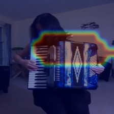
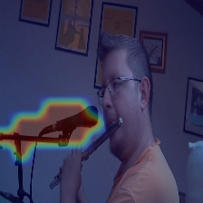
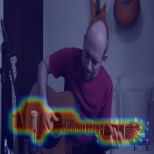
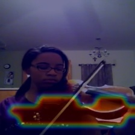
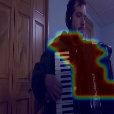
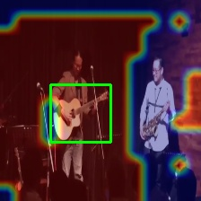
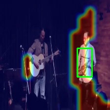
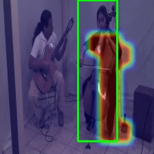
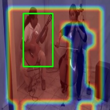

# DMC

Code for paper [Deep Multimodal Clustering for Unsupervised Audiovisual Learning](https://arxiv.org/abs/1807.03094). The code is implemented on PyTorch with python3. This repo includes training and testing code for audiovisual clustering with unlabeled videos.

### Requirements

- PyTorch 1.1
- torchvision
- scikit-learn
- librosa
- Pillow

### Running Procedure

#### Data Preparation

- Download dataset, e.g., MUSIC, and split into training/validation/testing set

- Extract frames at 4 fps by running 

  ```
  python3 data/cut_video.py
  ```

- Extract 1-second audio clips and turn into Log-Mel-Spectrogram by running

  ```
  python3 data/cut_audio.py
  ```

#### Training

```
location_dmc.py [-h]
optional arguments:
[--batch_size] training batchsize
[--learning_rate] learning rate
[--epoch] total training epoch
[--evaluate] only do testing or also training
[--v_cluster] number of visual clusters
[--a_cluster] number of audio clusters
```

```
python3 location_dmc.py --v_cluster 2 --a_cluster 1
```

Normally, the number of audio clusters is set to the number of audio classes, e.g., 1 for solo videos, and the number of visual clusters is set to the number of visual object classes plus 1 (background), e.g., 2 for solo videos.

#### Testing

```
python3 location_dmc.py --v_cluster 2 --a_cluster 1 --evaluate 1 --use_pretrain 1 --ckpt_file path/to/ckpt
```

The clustering result is saved in dmc.pkl, it could be used for qualitative visualization as well as quantitative evaluation.

### Examples

- Solo videos



- Duet videos






### Citation

```
@inproceedings{hu2019deep,
  title={Deep Multimodal Clustering for Unsupervised Audiovisual Learning},
  author={Hu, Di and Nie, Feiping and Li, Xuelong},
  booktitle={Proceedings of the IEEE Conference on Computer Vision and Pattern Recognition},
  pages={9248--9257},
  year={2019}
}

@article{hu2020curriculum,
  title={Curriculum audiovisual learning},
  author={Hu, Di and Wang, Zheng and Xiong, Haoyi and Wang, Dong and Nie, Feiping and Dou, Dejing},
  journal={arXiv preprint arXiv:2001.09414},
  year={2020}
}

```

